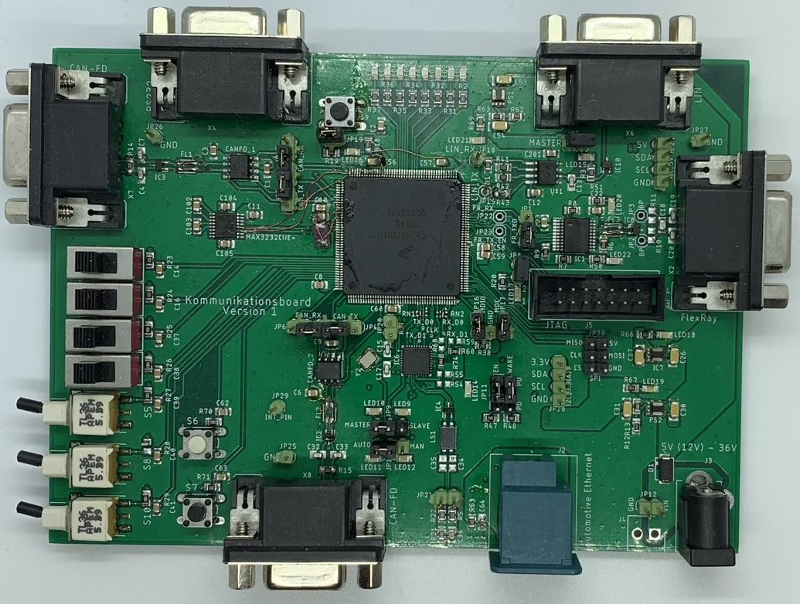

# MPC5746 Communication Board

This board and the software were created for a course during my studies at [HAW-Landshut](https://www.haw-landshut.de/)

It has the following communication system on-board:

- CAN-FD x2
- LIN
- FlexRay
- Automotive Ethernet (RMII,MDI,MDIO)
- I2C (3.3V and 5V)
- SPI
- RS232

Additionally, it has follwoing on-board:
- Two toggle switches, two slide switches, two push-buttons
- Eight LEDs

Currently there are seperated Software for every communication system:

- hello_world_mpc5746c:
	- All 8 LEDs light up in succession, sends one message via UART configured as GPIO with a baudrate of 1200. After that all LEDs off. This in a while loop.

- uart_pal_mpc5746c:
	- UART configured with LINFlexD Instance 1. Sends one welcomemessage via UART, waits for USER-input and echo the same back. 

- i2c_pal_mpc5746c:
	- Used with a DS3231 Real Time Module, sets the time via I2C 1 (5V) or when commented out I2C 0 (3.3V). Reads the time in a while loop and print it via UART.

- spi_pal_mpc5746c
	- Used with a Max6675 SPI Thermocoupler and a SPI Max7219 LED Matrix x4 LED Panel. When #define LEDMATRIX is uncommented then the address 0xFF will be send via SPI with the message conten of 0x1 or 0x0. Through this, two LED panels will be on or off.
		If #define MAX6675 is uncommented,  one SPI Message will be send with 0xFFFF to set the SPI Clock and SPI CS. The sensor response via MISO and these values will be print via UART.

- LIN_mpc5746c
	- Realised via Registers. Sends 0x6C6C6568 and 0x2020206F what represends "hello   "

- flexcan_mpc5746c 
	 
 	- #define MASTER //Board 2 (Press Button S6 or S7 on Board 2 or LED 4&5 will light if message from Board 1 arrives)
	  or
	- #define SLAVE //Board 1 (Press Button S6 or S7 on Board 1 or LED 4&5 will light if message from Board 2 arrives)

- enet_ping_mpc5746c
	- Waits for a ping request and respond to it. 
	- Additional, the PHY Register 0x3 will be read and if the value ist 0xA253 (DP83TC811 from TI) it toggles a LED
	
- flexray_mpc5746c:
 	- Still in work

Changelog from PCB V1 to V2:

- adapt footprint from the processor to add the GND pad. 
- remove 5V from VDD_LV and therefor connect 1.25V. 
- add capacitor to VDD_HV_FLA.
- small placement adjustment for better solder result. 
- swap pin of 3.3V I2C SDA from PE[12] pin 133 to PA[10] pin 132. 
- add externen oscillator.
- swap the pins for RS232 from GPIO port to LINFlexD_1 Interface. 
- swap 10kΩ resistor in LIN0_TX trace to 0Ω. 
- add two additional Chip Select Pins for SPI. 
